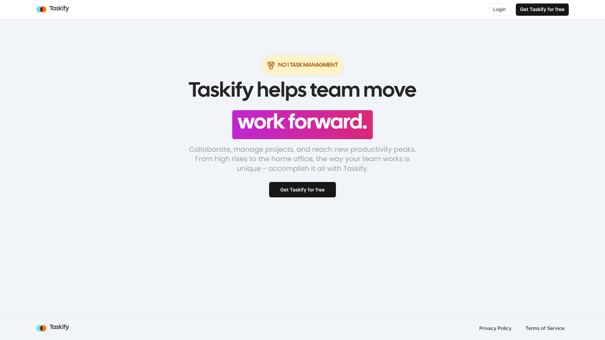

# Fullstack Trello Clone: Next.js 14, Server Actions, React, Prisma, Stripe, Tailwind, MySQL, Docker



This is a repository for Fullstack Trello Clone: Next.js 14, Server Actions, React, Prisma, Stripe, Tailwind, MySQL, Docker

Key Features:

-   Auth
-   Organizations / Workspaces
-   Board creation
-   Activity log for entire organization
-   Board rename and delete
-   List creation
-   List rename, delete, drag & drop reorder and copy
-   Card creation
-   Card description, rename, delete, drag & drop reorder and copy
-   Card activity log
-   Board limit for every organization
-   Landing page
-   MySQL DB
-   Prisma ORM
-   ShadcnUI & TailwindCSS

### Prerequisites

**Node version 18.x.x**

### Cloning the repository

```shell
git clone https://github.com/LiusDev/fer202-assignment.git
```

### Setup .env file

```js
NEXTJS_LOCAL_PORT=4000
NEXTJS_DOCKER_PORT=3000
NEXT_PUBLIC_CLERK_PUBLISHABLE_KEY=
CLERK_SECRET_KEY=
NEXT_PUBLIC_CLERK_SIGN_IN_URL=/sign-in
NEXT_PUBLIC_CLERK_SIGN_UP_URL=/sign-up
NEXT_PUBLIC_CLERK_AFTER_SIGN_IN_URL=/
NEXT_PUBLIC_CLERK_AFTER_SIGN_UP_URL=/

MYSQLDB_ROOT_PASSWORD=123456
MYSQLDB_DATABASE=taskify_db
MYSQLDB_LOCAL_PORT=3307
MYSQLDB_DOCKER_PORT=3306
```

### Install Dependencies

```shell
npm install
```

### Run Docker

```shell
docker-compose up --build
```

### Setup Prisma

Add MySQL Database

```shell
docker-compose exec taskify npx prisma generate
docker-compose exec taskify npx prisma db push
```

App will be running on [http://localhost:4000](http://localhost:4000)
